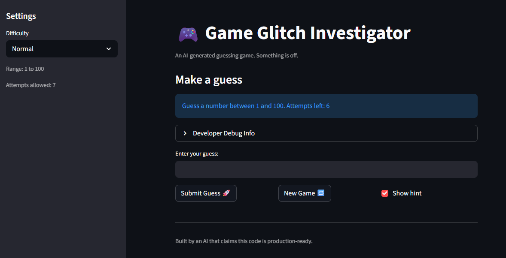
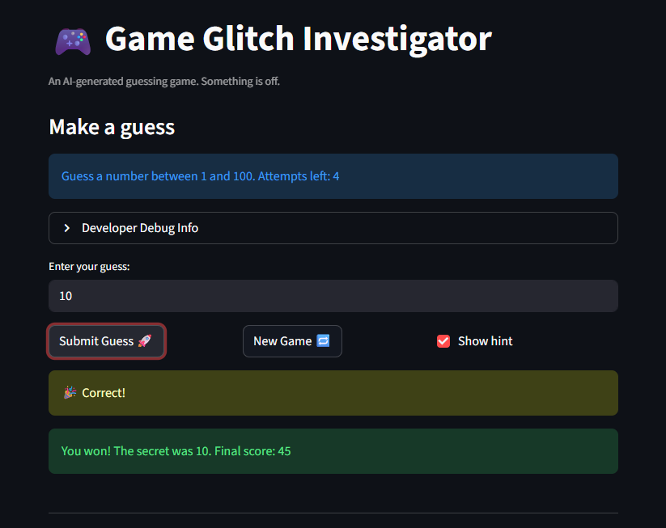

# 🎮 Game Glitch Investigator: The Impossible Guesser

## 🚨 The Situation

You asked an AI to build a simple "Number Guessing Game" using Streamlit.
It wrote the code, ran away, and now the game is unplayable. 

- You can't win.
- The hints lie to you.
- The secret number seems to have commitment issues.

## 🛠️ Setup

1. Install dependencies: `pip install -r requirements.txt`
2. Run the broken app: `python -m streamlit run app.py`

## 🕵️‍♂️ Your Mission

1. **Play the game.** Open the "Developer Debug Info" tab in the app to see the secret number. Try to win.
2. **Find the State Bug.** Why does the secret number change every time you click "Submit"? Ask ChatGPT: *"How do I keep a variable from resetting in Streamlit when I click a button?"*
3. **Fix the Logic.** The hints ("Higher/Lower") are wrong. Fix them.
4. **Refactor & Test.** - Move the logic into `logic_utils.py`.
   - Run `pytest` in your terminal.
   - Keep fixing until all tests pass!

## 📝 Document Your Experience

- [x] **Game's purpose:** A number guessing game where you try to guess a secret number within a set number of attempts. Hints tell you if your guess is too high or too low.

- [x] **Bugs found:**
  - Hints were backwards (Too High / Too Low were wrong)
  - New Game button didn't actually restart the game
  - Hard mode had a smaller range than Normal (1–50 vs 1–100)
  - Easy had fewer attempts than Normal

- [x] **Fixes applied:**
  - Fixed the hint logic so comparisons are always numeric
  - Fixed New Game to reset all session state
  - Corrected difficulty ranges and attempt limits
  - Moved game logic into `logic_utils.py`

## 📸 Demo

- [ ] 
- []
[Insert a screenshot of your fixed, winning game here]

## 🚀 Stretch Features

- [ ] [If you choose to complete Challenge 4, insert a screenshot of your Enhanced Game UI here]
